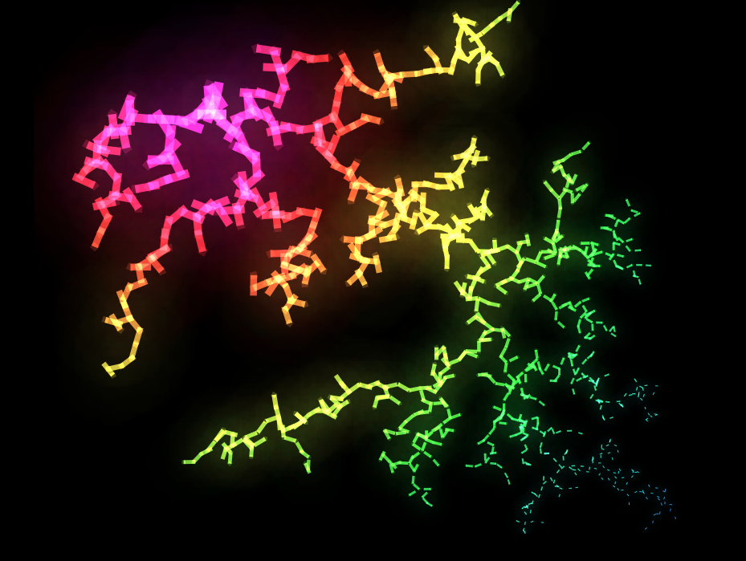
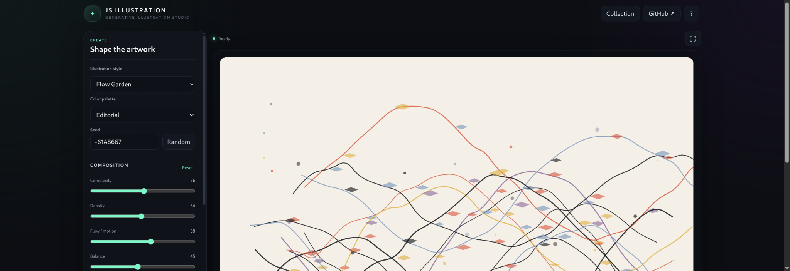

# JS Illustration

**A lightweight generative illustration studio built with HTML, CSS, JavaScript and Canvas 2D.**

JS Illustration started as a small experimental Canvas project that generated a new abstract neon artwork on each reload. The current version rebuilds that idea into a complete, responsive and interactive **generative illustration studio** where users can create, customize, save and export procedural artwork directly in the browser.

> No backend. No API. No AI image generation. The artwork is created procedurally with JavaScript.

---

## From V1 to the current version

### V1 — Original experiment



The first version focused on a single visual experiment: colorful branching structures generated with JavaScript and Canvas. It established the project idea, but it had no real editor, no responsive interface, no deterministic seed system and no export workflow.

### Current version — Generative Illustration Studio



The project has now evolved into a complete creation tool. Instead of generating only one kind of neon branching artwork, users can choose between multiple procedural illustration styles, edit the composition from the interface, regenerate the artwork from a seed, save compositions locally and export the final result.

---

## What changed

| V1 | Current version |
| --- | --- |
| Single neon branching experiment | Multi-style generative illustration studio |
| Fixed visual language | Six procedural illustration engines |
| Minimal Canvas-only interface | Complete creative editor UI |
| Reload/click-oriented generation | Explicit Generate and Surprise Me workflow |
| Random-only results | Deterministic seed system |
| No front-end customization | Live composition and appearance controls |
| Fixed presentation | Responsive desktop, tablet and mobile layouts |
| No mobile-specific controls | Touch-friendly drawer/bottom-sheet experience |
| No performance modes | Eco, Balanced and High quality modes |
| No collection | Local collection using `localStorage` |
| No export workflow | PNG, JPG, SVG and PDF export |
| Raster Canvas only | Canvas rendering plus true vector SVG export |
| No reusable architecture | Modular engine, renderer, presets and exporter |

---

## Illustration styles

The current version includes six procedural engines built on the same lightweight architecture:

- **Flow Garden** — flowing organic paths with decorative geometric details.
- **Paper Cut** — layered abstract shapes inspired by paper-cut compositions.
- **Topographic** — contour-like line systems and map-inspired structures.
- **Geo Collage** — geometric compositions using circles, polygons, paths and accents.
- **Botanical** — procedural stems, leaves and plant-inspired forms.
- **Orbit Field** — orbital lines, nodes and connected circular structures.

Each style responds to the same editing workflow while producing a distinct visual result.

---

## Interactive controls

Users can customize the generated artwork directly from the interface:

- Illustration style
- Color palette
- Deterministic seed
- Complexity
- Density
- Flow / motion
- Composition balance
- Stroke weight
- Detail level
- Mirror mode
- Canvas aspect ratio
- Quality mode

The **Random** seed button creates a new seed, while **Surprise Me** generates a broader randomized combination of style and settings.

---

## Deterministic generation

JS Illustration uses seeded pseudo-random generation.

That means:

```text
same seed + same settings = same illustration
```

A composition can therefore be recreated later instead of being permanently lost after a reload.

---

## Responsive design

The current version was redesigned to work across desktop, tablets and phones instead of simply shrinking the desktop layout.

### Desktop

- Persistent creation panel
- Large artboard
- Full action toolbar

### Tablet

- Off-canvas controls
- More space dedicated to the artwork
- Touch-friendly editing

### Mobile

- Controls become a bottom sheet / compact mobile editor
- Actions reorganize to avoid horizontal overflow
- Touch targets are enlarged
- Inputs are sized to avoid unwanted browser zoom
- Safe-area insets are supported for modern phones
- Portrait and landscape layouts are handled separately

Structural sliders also avoid continuously rebuilding the illustration during touch dragging, reducing unnecessary work on lower-powered mobile devices.

---

## Performance approach

The application is intentionally designed to remain lightweight.

- No permanent 60 FPS animation loop
- Artwork is generated only when required
- Display-only changes can rerender existing artwork data
- Structural controls use delayed/debounced regeneration
- Primitive counts are capped by quality mode
- Device pixel ratio is limited for the visible Canvas
- Mobile rendering uses an additional pixel budget
- High-resolution export is rendered separately from the on-screen Canvas

This keeps the editor responsive while still allowing high-quality final exports.

---

## Export formats

The generated illustration can be exported as:

- **PNG** — lossless raster output
- **JPG** — compressed raster output
- **SVG** — true vector output built from generated primitives
- **PDF** — high-quality single-page document export

SVG files are not screenshots embedded inside an SVG container. The exporter reconstructs the artwork using vector elements such as paths, circles and polygons.

---

## Local collection

Users can save generated compositions locally in the browser.

The collection stores lightweight artwork state such as:

- seed
- style
- palette
- composition settings
- title
- timestamp

It does not store large screenshots inside `localStorage`.

---

## Project structure

This release uses a **flat root structure** so every file can be selected and uploaded at once through GitHub’s **Add files → Upload files** interface.

```text
js-illustration/
├── index.html
├── styles.css
├── favicon.svg
├── README.md
├── app.js
├── engine.js
├── exporter.js
├── presets.js
├── random.js
├── renderer.js
├── smoke.html
├── v1-original.png
└── v3-responsive-studio.png
```

### Main modules

- `random.js` — seeded pseudo-random utilities.
- `presets.js` — palettes, defaults and shared presets.
- `engine.js` — procedural illustration generation.
- `renderer.js` — Canvas rendering and display sizing.
- `exporter.js` — PNG, JPG, SVG and PDF exports.
- `app.js` — UI state, controls, collection and application behavior.

---

## Running locally

No build step is required.

1. Download or clone the repository.
2. Open `index.html` in a modern browser.

You can also use any simple static HTTP server if preferred.

---

## GitHub Pages

The project is fully static and can be published directly with GitHub Pages.

1. Push the project files to the repository root.
2. Open **Settings → Pages** on GitHub.
3. Select the branch used for deployment.
4. Publish from the repository root.

No backend configuration is required.

---

## Design direction

The original project was an experiment in procedural visuals. The current version keeps the same central idea — **creating artwork through code** — but changes the product direction completely.

The goal is no longer to display one specific effect. JS Illustration is now designed as a reusable creative playground where different generative systems can coexist behind one consistent editing experience.

Future illustration engines can be added without rebuilding the whole application.

---

## Roadmap

Possible future improvements:

- Additional procedural illustration engines
- More palettes and curated presets
- Shareable artwork URLs
- Advanced SVG controls
- Optional animation-based styles
- Preset import/export
- Improved accessibility tooling
- Automated visual regression tests

---

## Tech stack

- HTML5
- CSS3
- Vanilla JavaScript
- Canvas 2D
- SVG
- Browser `localStorage`

No framework is required.

---

## License

No license is currently included. Add a license before accepting external reuse or contributions if you want to define how the project may be copied, modified or commercialized.

---

### Built as a generative art experiment. Evolved into a generative illustration studio.
